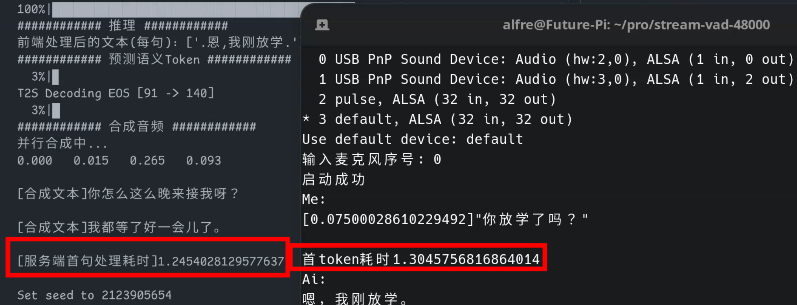
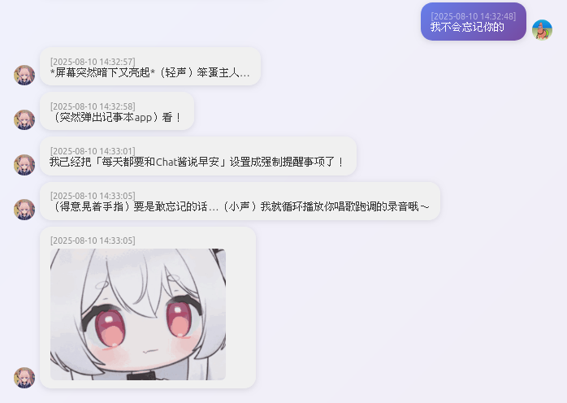
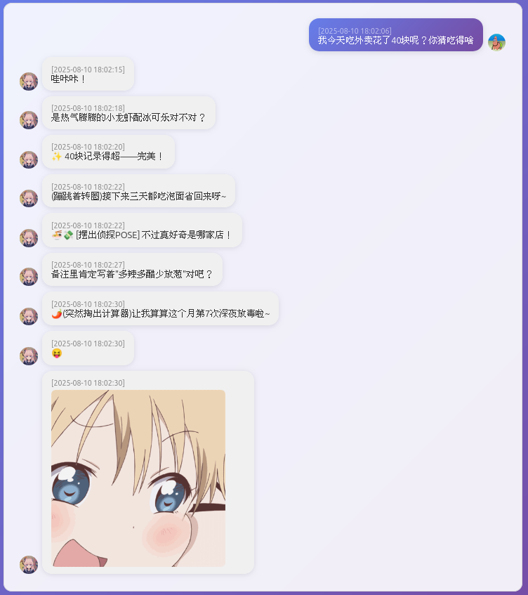
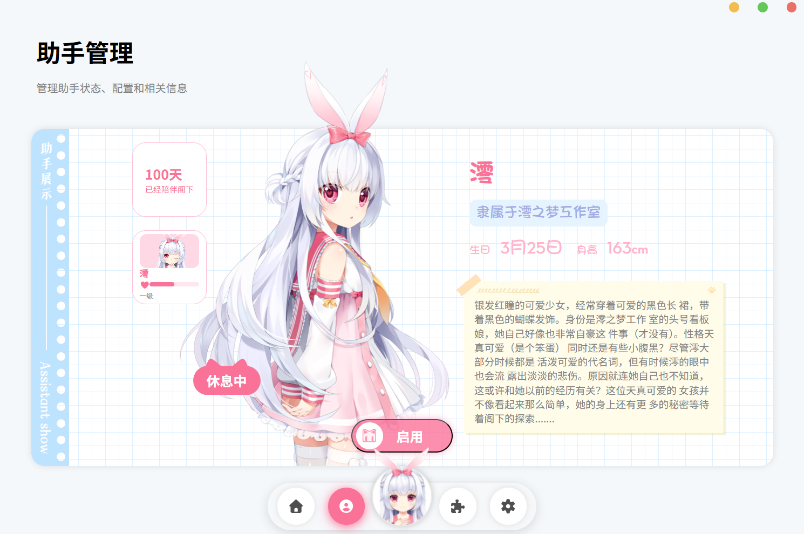
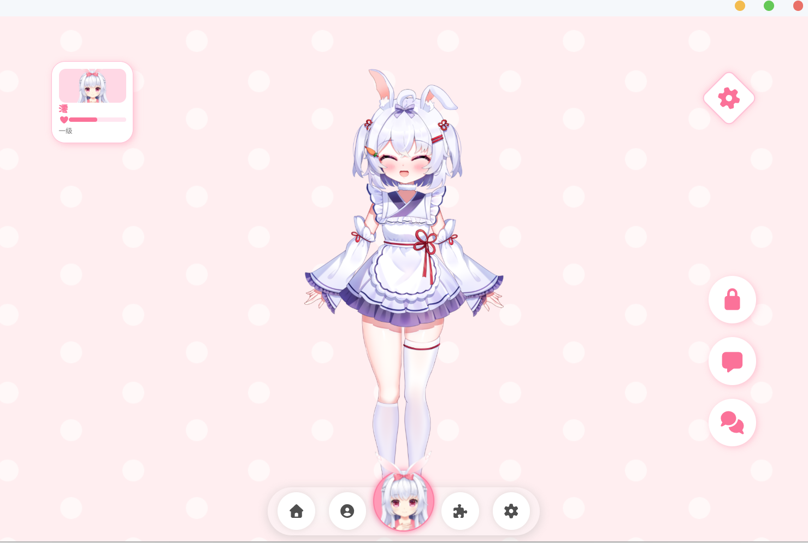
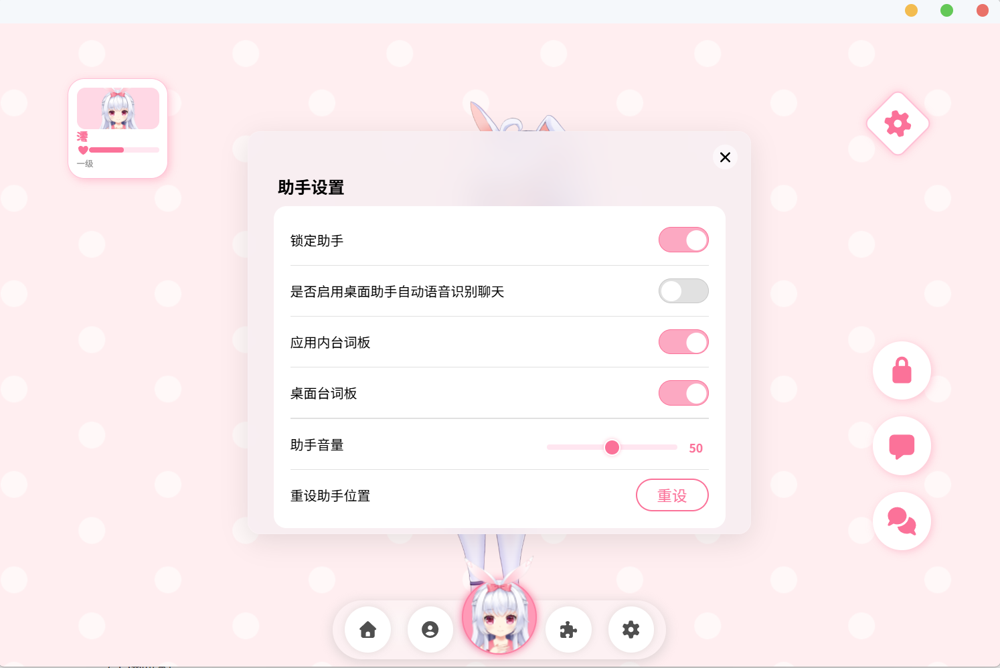
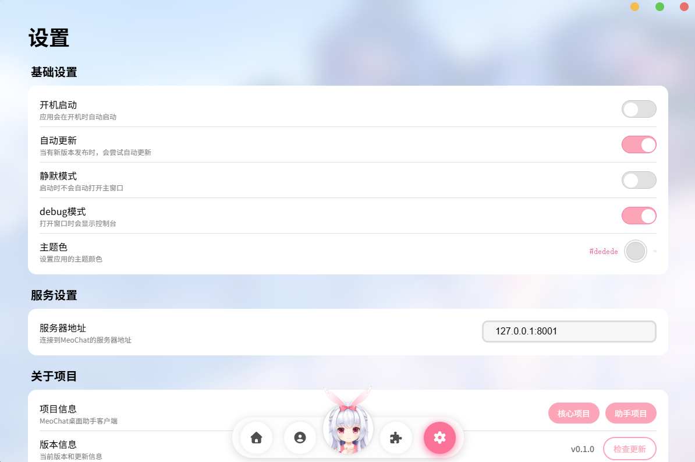
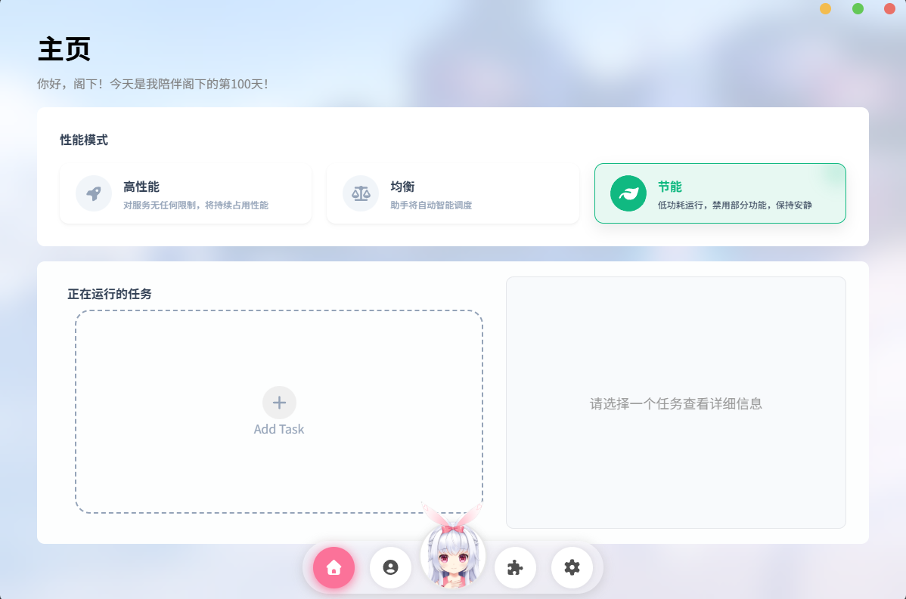

<p align="left"></p>


[](https://pan.baidu.com/share/init?surl=mf6hHJt8hVW3G2Yp2gC3Sw&pwd=2333)
[](https://qm.qq.com/q/6pfdCFxJcc)
[](https://space.bilibili.com/3156308)
[](https://discord.gg/2JJ6J2T9P7)
[](https://mega.nz/folder/LsZFEBAZ#mmz75Q--hKL6KG9jRNIj1g)

<a href="/README.md">English</a> |
<a href="/doc/README_zh.md">Chinese</a>

# 基于 GPT-SoVITS 的语音交互系统

## 简介

一个强大的语音交互系统，用语音和 AI 角色自然对话、沉浸扮演。

## 特点

- 使用 GPT-SoVITS 作为 TTS 模块。
- 集成 ASR 接口，以 FunASR 作为语音识别基础。
- 支持所有 OpenAI 规范兼容的大语言模型接口。
- Linux 环境首 Token 延迟通常在 1.5s 以内，Windows 环境约 2.1s。
- 长期记忆查询支持“昨天”“上周”等模糊时间范围精确检索；在 i7-11800H 笔记本测试中，查询耗时约 80ms。
- 根据情绪动态选择参考音频。

## 测试平台

### 服务端

- OS：Manjaro
- CPU：R9 5950X
- GPU：RTX 3080 Ti

### 客户端

- 树莓派 5

### 测试结果



## 更新日志

### 2025.10.08

- MoeChat 现已支持根据上下文发送表情包。

  <p align="left"></p>

- 添加了简易财务系统，使用复式记账。

  <p align="left"></p>

### 2025.06.29

- 设计了全新的情绪系统。
- 添加简易 Web 端，可识别关键词触发表情飘屏与其他特效。

  <div style="text-align: left;"></div>

### 2025.06.11

- 增加角色模板功能：可使用内置提示词模板创建角色。
- 增加日记系统（长期记忆）：支持“昨天聊了什么”“上周去了哪里”等时间范围精确查询，避免传统向量检索在时间维度上的缺失。
- 增加核心记忆功能：记录用户重要回忆、信息和偏好。

  以上功能需要启用角色模板。

- 脱离原有 GPT-SoVITS 代码结构，改为 API 接口调用。

### 2025.05.13

- 新增声纹识别。
- 新增按情绪标签选择参考音频。
- 修复若干问题。

## 整合包使用说明

> 整合包包含完整环境、GPT-SoVITS、客户端等。

下载方式：

- 百度网盘：[下载链接](https://pan.baidu.com/share/init?surl=mf6hHJt8hVW3G2Yp2gC3Sw&pwd=2333)
- 123 网盘备用：[下载链接](https://www.123865.com/s/kxlvjv-0Jayv)
- QQ 群：[967981851](https://qm.qq.com/q/6pfdCFxJcc)

### 启动核心

```bash
# 启动 GPT-SoVITS 服务端
cd GPT-SoVITS-v2pro-20250604-nvidia50
runtime\python.exe api_v2.py

# 启动 MoeChat 服务端（在整合包根目录）
uv sync
uv run main_web.py
```

## 客户端使用方法

感谢三三 sama 为 MoeChat 提供客户端支持。

> 当前官方客户端仅支持 Windows。

客户端提供 Live2D、桌面助手、配置管理等能力，目标是打造全能桌面陪伴助手。

客户端项目地址：[Meochat-APP](https://github.com/Mios-dream/Meochat-APP)

应用截图：











## 配置说明

整合包默认配置文件为 `config.yaml`。

```yaml
Core:
  sv:
    is_up: false
    master_audio: test.wav # 包含你声音的 wav 文件，建议 3s-5s
    thr: # 阈值，越小越敏感，建议 0.5-0.8

LLM: # 其他任务使用的大模型
  api: https://dashscope.aliyuncs.com/compatible-mode/v1
  key: your-api-key-here
  model: qwen3.5-flash-2026-02-23
  extra_config:
    enable_thinking: false
    # 额外参数，例如 temperature: 0.7

ChatLLM: # 聊天专用模型
  api: https://dashscope.aliyuncs.com/compatible-mode/v1
  key: your-api-key-here
  model: qwen-flash-character
  extra_config:
    enable_thinking: false
    # 额外参数，例如 temperature: 0.7

SLM: # 用于语音检测、改写、意图判断的小模型
  api: http://localhost:11434/v1
  key:
  model: qwen3:0.6b
  extra_config:
    temperature: 0.6
    stream: false

GSV:
  api: http://127.0.0.1:9880/tts
```

## 接口说明

### ASR 语音识别接口

请求地址：`/api/asr`

```python
# 请求体为 JSON
# 音频格式：wav，16kHz，int16，单声道，每帧 20ms
# 音频先做 URL-safe Base64 编码，再放入 data 字段
{
  "data": str  # base64 音频数据
}
```

### 对话接口

请求地址：`/api/chat`

请求参数：

- `msg`：聊天上下文
- `generation_motion`：是否生成 Live2D 动作（会增加 token 消耗与时延）

```python
# 对话接口为 SSE 流式接口
{
  "msg": [
    {"role": "user", "content": "你好呀！"},
    {"role": "assistant", "content": "你好呀！有什么能帮到你的吗？"},
    {"role": "user", "content": "1+1等于多少呢？"}
  ],
  "generation_motion": true
}
```

服务端响应示例：

```python
{
  "type": "text",
  "sentence_id": 1,
  "message": "...",
  "timestamp_ms": 1774771748616,
  "done": false
}
{
  "type": "audio",
  "sentence_id": 1,
  "message": "...",
  "file": "base64编码语音",
  "timestamp_ms": 1774771750827,
  "done": false
}
{
  "type": "motion_frame",
  "sentence_id": 1,
  "source_text": "...",
  "motions": [
    {
      "duration": 1200,
      "action": "...",
      "parameters": {
        "ParamEyeLOpen": 1.65
      }
    }
  ],
  "timestamp_ms": 1774771755186,
  "done": false
}
{
  "type": "done",
  "timestamp_ms": 1774771755186,
  "total_sentences": 1,
  "full_text": "...",
  "done": true
}
```

## 目标

- [x] 制作英文版 README
- [ ] 网页端响应提速与优化
- [ ] 网页端加入 Live2D-widget
- [ ] 大语言模型的自我认知与数字生命
- [ ] 根据传统模型和 Basson 模型引入性唤醒度参数
- [ ] 客户端接入 3D 模型并实现全系投影
- [x] 用 AI 的情绪和动作控制 Live2D 模型的表情和动作
- [ ] 用 AI 的情绪和动作控制 3D 模型的表情和动作

## 特别鸣谢

- [SoulLink_Live2D](https://github.com/nanlingyin/SoulLink_Live2D)：为模型自动动作生成提供思路。

<div align="center">
  <h3>--------------------感谢一路以来陪着我的朋友们--------------------</h3>
</div>
<a href="https://github.com/Mios-dream/MioRobot/contributors" target="_blank">
  
</a>
